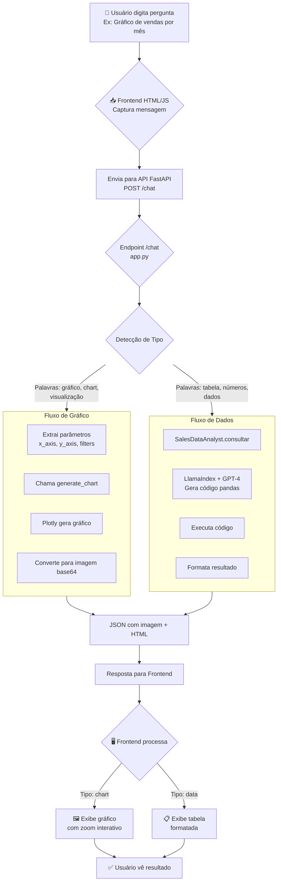

#🤖Chatbot Analítico de Vendas com LlamaIndex
---

##**Vantagens sobre RAG Tradicional de Documentos**

| Característica | RAG Tradicional (Documentos) | Este Projeto (Dados Estruturados)           |
|----------------|------------------------------|---------------------------------------------|
| Entrada        | PDFs, Word, textos           | DataFrames, bancos de dados SQL             |
| Saída          | Resumos, extração de info    | Código executável, análises estatísticas    |
| Precisão       | Busca semântica textual      | Cálculos matemáticos exatos                 |
| Capacidade     | Q&A sobre documentos         | Análise descritiva, tendências, comparações temporais   |
| Aplicação      | Conhecimento textual         | Business Intelligence, Data Analytics       |

---
### Fluxo Operacional Completo
###  Fluxo do Chatbot (RAG + GPT-3.5)

---
### **Arquitetura Técnica**  
### **Componentes Principais**

| Módulo          | Tecnologia           | Função                                  |
|-----------------|---------------------|----------------------------------------|
| API Server      | FastAPI + Uvicorn    | Endpoints REST, documentação automática |
| Analytics Engine| LlamaIndex + GPT-4o  | Geração de código Pandas inteligente    |
| Memory System   | LangChain Buffer     | Histórico de conversação                 |
| Visualization   | Plotly + Matplotlib  | Gráficos estáticos e interativos        |
| Cost Tracker    | Custom Python        | Monitoramento financeiro em tempo real  |
| Vector Store    | ChromaDB             | Armazenamento de conhecimento empresarial |

