#🤖Chatbot Analítico de Vendas com LlamaIndex
---

##**Vantagens sobre RAG Tradicional de Documentos**

| Característica | RAG Tradicional (Documentos) | Este Projeto (Dados Estruturados)           |
|----------------|------------------------------|---------------------------------------------|
| Entrada        | PDFs, Word, textos           | DataFrames, bancos de dados SQL             |
| Saída          | Resumos, extração de info    | Código executável, análises estatísticas    |
| Precisão       | Busca semântica textual      | Cálculos matemáticos exatos                 |
| Capacidade     | Q&A sobre documentos         | Análise descritiva, tendências, comparações temporais   |
| Aplicação      | Conhecimento textual         | Business Intelligence, Data Analytics       |

---
### Fluxo Operacional Completo
### 🔄 Fluxo do Chatbot (RAG + GPT-3.5)

```mermaid
flowchart TD
    A[👤 Usuário digita pergunta<br>Ex: Gráfico de vendas por mês] --> B{📥 Frontend HTML/JS<br>Captura mensagem}
    
    B --> C[📤 Envia para API FastAPI<br>POST /chat]
    
    C --> D{🧠 Endpoint /chat<br>app.py}
    
    D --> E{🔍 Detecção de Tipo}
    
    E -- "Palavras: gráfico, chart,<br>visualização" --> F[🎨 Processa como GRÁFICO]
    E -- "Palavras: tabela, números,<br>dados" --> G[📊 Processa como DADOS]
    
    subgraph F [Fluxo de Gráfico]
        F1[📈 Extrai parâmetros<br>x_axis, y_axis, filters]
        F2[🎯 Chama generate_chart]
        F3[📊 Plotly gera gráfico]
        F4[🖼️ Converte para imagem base64]
    end
    
    subgraph G [Fluxo de Dados]
        G1[🤖 SalesDataAnalyst.consultar]
        G2[🧠 LlamaIndex + GPT-4<br>Gera código pandas]
        G3[🐼 Executa código]
        G4[🎨 Formata resultado]
    end
    
    F --> H[JSON com imagem + HTML]
    G --> H
    
    H --> I[📦 Resposta para Frontend]
    
    I --> J{🖥️ Frontend processa}
    
    J -- "Tipo: chart" --> K[🖼️ Exibe gráfico<br>com zoom interativo]
    J -- "Tipo: data" --> L[📋 Exibe tabela<br>formatada]
    
    K --> M[✅ Usuário vê resultado]
    L --> M
```

---
### **Arquitetura Técnica**  
### **Componentes Principais**

| Módulo          | Tecnologia           | Função                                  |
|-----------------|---------------------|----------------------------------------|
| API Server      | FastAPI + Uvicorn    | Endpoints REST, documentação automática |
| Analytics Engine| LlamaIndex + GPT-4o  | Geração de código Pandas inteligente    |
| Memory System   | LangChain Buffer     | Histórico de conversação                 |
| Visualization   | Plotly + Matplotlib  | Gráficos estáticos e interativos        |
| Cost Tracker    | Custom Python        | Monitoramento financeiro em tempo real  |
| Vector Store    | ChromaDB             | Armazenamento de conhecimento empresarial |

